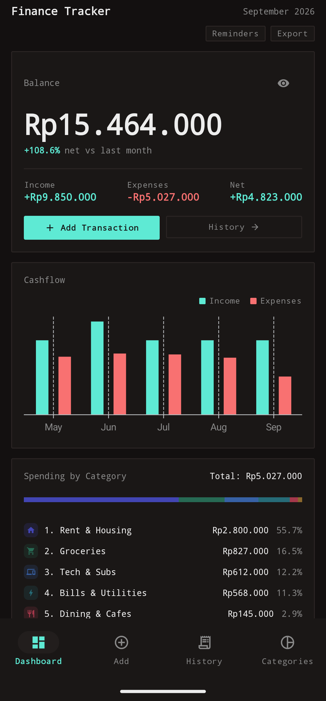
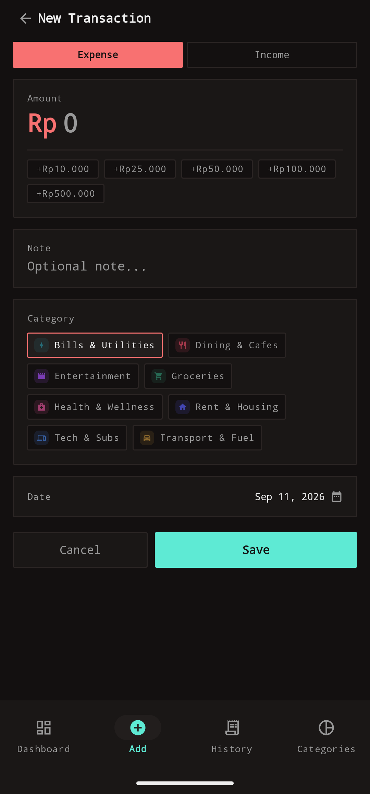
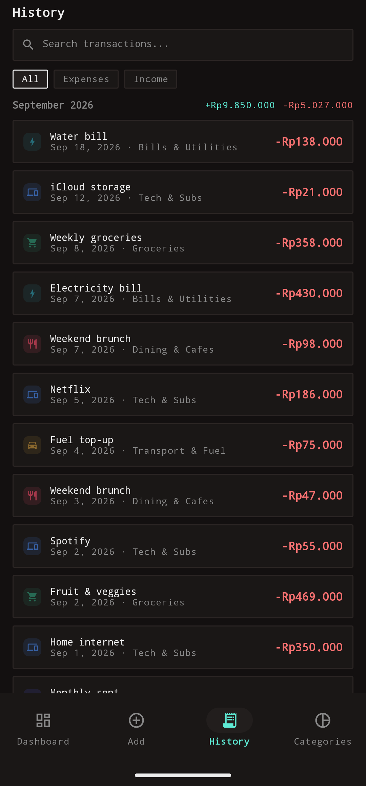
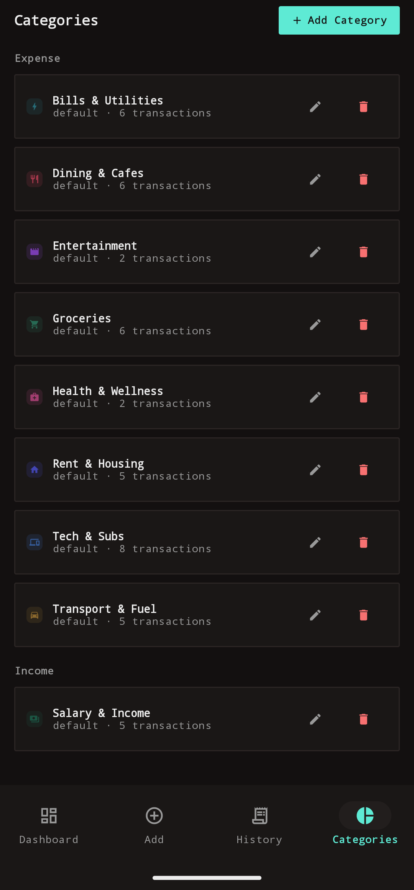
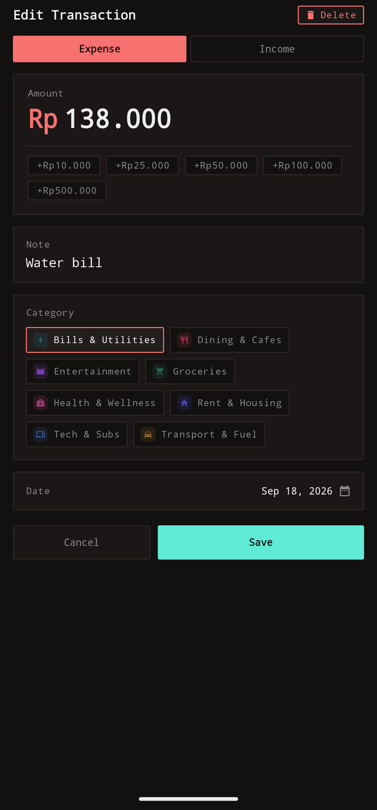

# Finance Tracker

A local-first Android expense & income tracker built with Jetpack Compose.

## Features

- **Dashboard** — running balance (mask/unmask), current-month income / expense / net vs last month, 5-month cashflow bars, spending-by-category breakdown, spending trend, recent transactions
- **Add / edit transactions** — expense/income toggle, whole-Rupiah amounts with quick-add presets (`+Rp10.000` … `+Rp500.000`), note, category picker, date picker, delete on edit
- **History** — month-grouped list with per-month totals, search, and All/Expenses/Income filters
- **Categories** — editable defaults + custom categories, each with a color and icon (icons render as tinted glyph tiles across every screen)
- **Recurring reminders** — daily/weekly/monthly/yearly templates that post a notification on the next due date (never auto-creates transactions), re-armed across reboots
- **CSV / JSON export** — date-range export via the system save dialog with pre-filled filenames
- **Backup & Restore** — versioned JSON backup of all data via the system save dialog, restorable on a new device or after a reinstall — restore **replaces** all existing data, it does not merge
- **Single currency** — Indonesian Rupiah stored as whole-number `Long`s (no float math)

## Screenshots

<table>
  <tr>
    <td align="center" width="50%">
      <br>
      <b>Dashboard</b> — balance, cashflow, category breakdown
    </td>
    <td align="center" width="50%">
      <br>
      <b>Add</b> — quick income / expense entry
    </td>
  </tr>
  <tr>
    <td align="center" width="50%">
      <br>
      <b>History</b> — month-grouped list with per-month totals
    </td>
    <td align="center" width="50%">
      <br>
      <b>Categories</b> — editable defaults + custom color/icon tiles
    </td>
  </tr>
  <tr>
    <td align="center" colspan="2">
      <br>
      <b>Edit Transaction</b> — full form with amount presets
    </td>
  </tr>
</table>

## Tech stack

- Kotlin + Jetpack Compose (Material 3), single-activity architecture
- Room (Flow-based DAOs, `@Transaction` reassign-and-delete)
- Navigation Compose (4-tab bottom navigation + pushed full-screen edit/utility routes)
- Vico for cashflow bar + trend line charts
- kotlinx.serialization for the backup JSON format
- AlarmManager + `BroadcastReceiver` for recurring reminders
- JUnit unit tests for export serialization, amount quick-add logic, and backup encode/decode/validate/restore logic

## Requirements

- JDK 17+ (Android Studio's bundled JBR works)
- Android SDK (minSdk 26, target & compileSdk 36)
- The Gradle wrapper downloads Gradle 9.3.1 automatically — no manual Gradle install needed

## Build & run

The repo includes a [Gradle wrapper](https://docs.gradle.org/current/userguide/gradle_wrapper.html), so no Gradle installation is required.

**From Android Studio:** open the repo root, let Gradle sync, select the `app` run configuration, and Run.

**From the command line:**

```bash
# macOS / Linux
./gradlew :app:installDebug

# Windows
gradlew.bat :app:installDebug
```

The debug APK is installed directly onto a connected device/emulator. To just compile, use `:app:compileDebugKotlin`; to run the unit tests, use `:app:testDebugUnitTest`.

## License

[MIT](LICENSE)
