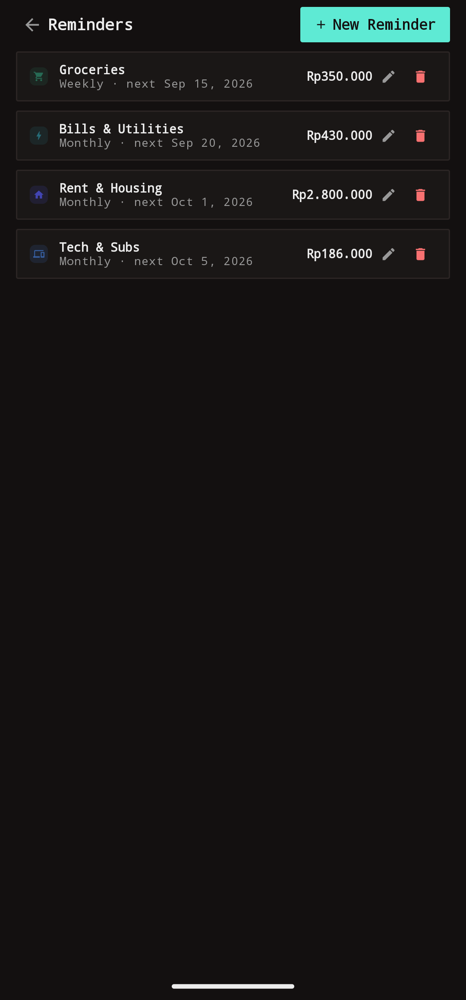
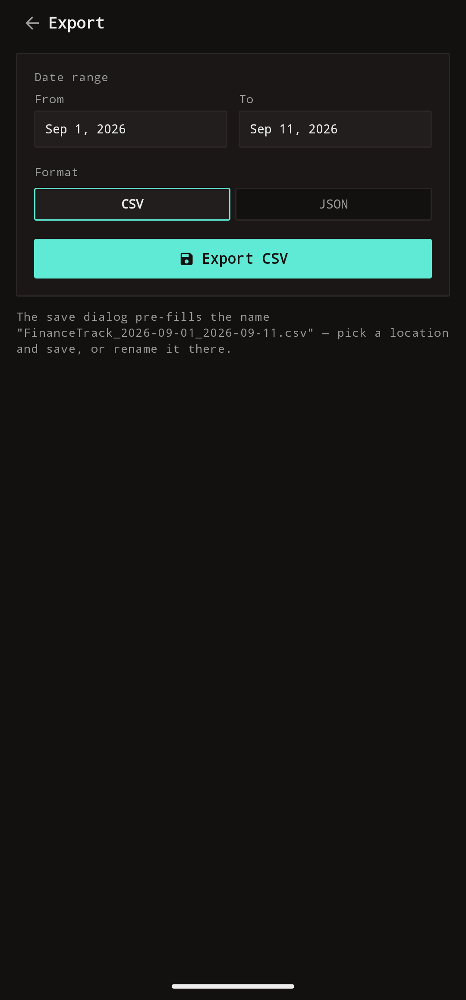
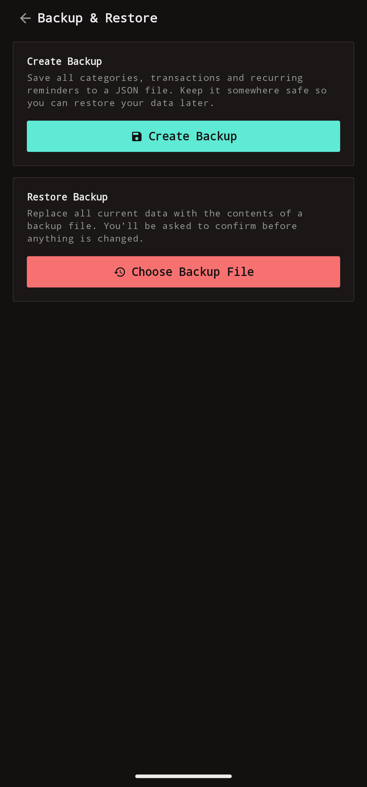

# Finance Tracker

[](https://github.com/afif25fradana/Finance-Tracker/actions/workflows/tests.yml)

Finance Tracker is a simple, private, offline-first personal finance app for Android. It helps you track your daily income, expenses, and recurring bills in Indonesian Rupiah without creating an account or sending your data anywhere.

Most budgeting apps require signing up, demand access to SMS or bank APIs, or sync your transactions to third-party cloud servers. Finance Tracker keeps all your financial records strictly on your device in an offline SQLite database. There is no internet permission in the application manifest, no ads, no trackers, and no third-party analytics.

## What it can do

- Works offline with zero internet permissions requested.
- Running balance with privacy mask, monthly income vs. expense summary, 5-month cashflow bars, and category breakdown.
- Quick transaction entry with Rupiah presets (+Rp10.000 to +Rp500.000) and notes.
- Custom categories with color tags and icons.
- Recurring reminders (daily, weekly, monthly, yearly) that notify you at 09:00 on due dates to log bills manually; the app never creates entries automatically.
- Date-filtered CSV and JSON export for spreadsheets or external backups.
- Single-file JSON backup and restore.

## Screenshots

<table>
  <tr>
    <td align="center" width="33%">
      <br>
      <b>Dashboard</b><br>Balance, cashflow & category breakdown
    </td>
    <td align="center" width="33%">
      <br>
      <b>Add Transaction</b><br>Quick income / expense entry
    </td>
    <td align="center" width="33%">
      <br>
      <b>History</b><br>Month-grouped list with monthly totals
    </td>
  </tr>
  <tr>
    <td align="center" width="33%">
      <br>
      <b>Categories</b><br>Custom colors and icon glyphs
    </td>
    <td align="center" width="33%">
      <br>
      <b>Edit Transaction</b><br>Transaction details and amount presets
    </td>
    <td align="center" width="33%">
      <br>
      <b>Reminders</b><br>Bill reminders with due date tracking
    </td>
  </tr>
  <tr>
    <td align="center" width="33%">
      <br>
      <b>Export</b><br>Date-range CSV and JSON exports
    </td>
    <td align="center" width="33%">
      <br>
      <b>Backup & Restore</b><br>Versioned JSON backup and restore
    </td>
    <td align="center" width="33%">
    </td>
  </tr>
</table>

## Installation

### Option 1: Download the pre-built APK (Recommended)

Download the latest release directly to your Android device:
[FinanceTracker-v1.1.0.apk](https://github.com/afif25fradana/Finance-Tracker/releases/download/v1.1.0/FinanceTracker-v1.1.0.apk)

#### Checksum verification

| File | SHA-256 Hash |
| :--- | :--- |
| `FinanceTracker-v1.1.0.apk` | `e9d26deef831b48afde0727a86fed7ad5077ef69d90b00194db34944fcbe9655` |

To verify on Windows (PowerShell):
```powershell
Get-FileHash FinanceTracker-v1.1.0.apk -Algorithm SHA256
```

To verify on macOS or Linux:
```bash
sha256sum FinanceTracker-v1.1.0.apk
```

### Option 2: Build from source

If you want to build the app yourself or inspect the code, see [TECHNICAL.md](TECHNICAL.md) for build instructions and prerequisites.

## A few things to keep in mind

- All amounts are tracked in whole Indonesian Rupiah (`Rp`) without decimal subdivisions.
- Reminders notify you at 09:00 on the due date without auto-logging charges. You decide when to log.
- Restoring a backup replaces the current database rather than merging records.
- All data stays on device; export a backup before wiping or switching phones.

## Technical documentation

For technical specifications, codebase architecture, building from source, running the test suite, and quality gates, please read [TECHNICAL.md](TECHNICAL.md).

## License

[MIT](LICENSE)
